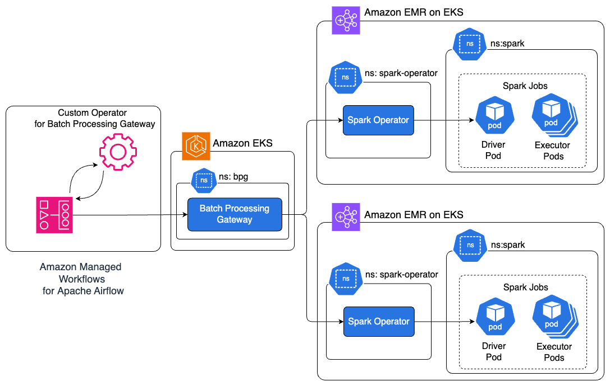
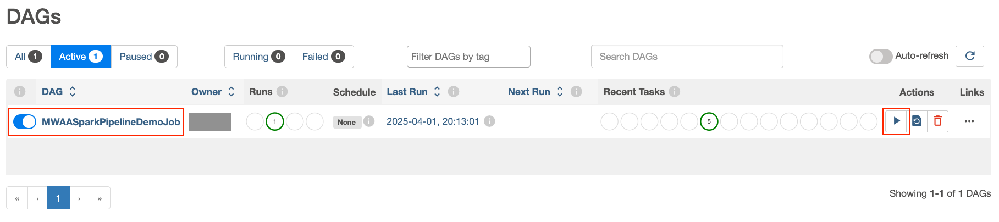

# Build end-to-end Apache Spark pipelines with Amazon MWAA, Batch Processing Gateway, and Amazon EMR on EKS clusters

## Introduction

This repository accompanies the AWS Big Data Blog post [Build end-to-end Apache Spark pipelines with Amazon MWAA, Batch Processing Gateway, and Amazon EMR on EKS clusters](https://aws.amazon.com/blogs/big-data/build-end-to-end-apache-spark-pipelines-with-amazon-mwaa-batch-processing-gateway-and-emr-on-eks-clusters/). It shows how to enhance the multi-cluster solution by integrating Amazon Managed Workflows for Apache Airflow (Amazon MWAA) with BPG. By using Amazon MWAA, we add job scheduling and orchestration capabilities, enabling you to build a comprehensive end-to-end Spark-based data processing pipeline.

## Solution Overview

The solution consists of integrating Amazon MWAA with BPG through an [Airflow custom operator](https://airflow.apache.org/docs/apache-airflow/stable/howto/custom-operator.html) for BPG called `BPGOperator`. This operator encapsulates the infrastructure management logic needed to interact with BPG. `BPGOperator` provides a clean interface for job submission through Amazon MWAA. When executed, the operator communicates with BPG, which then routes the Spark workloads to available EMR on EKS clusters based on predefined routing rules.

The following architecture diagram illustrates the components and their interactions.



The solution works through the following steps:

* Amazon MWAA executes scheduled DAGs using `BPGOperator`. Data engineers create DAGs using this operator, requiring only the Spark application configuration file and basic scheduling parameters.
  
* `BPGOperator` authenticates and submits jobs to the BPG submit endpoint `POST:/apiv2/spark`. It handles all HTTP communication details, manages authentication tokens, and provides secure transmission of job configurations.
  
* BPG routes submitted jobs to EMR on EKS clusters based on predefined routing rules. These routing rules are managed centrally through BPG configuration, allowing rules-based distribution of workloads across multiple clusters.
  
* `BPGOperator` monitors job status, captures logs, and handles execution retries. It polls the BPG job status endpoint `GET:/apiv2/spark/{subID}/status` and streams logs to Airflow by polling the `GET:/apiv2/log` endpoint every second. The BPG log endpoint retrieves the most current log information directly from the Spark Driver Pod.
  
* The DAG execution progresses to subsequent tasks based on job completion status and defined dependencies. `BPGOperator` communicates the job status through Airflow’s built-in task communication system, enabling complex workflow orchestration.

Refer to the BPG [REST API interface](https://github.com/apple/batch-processing-gateway?tab=readme-ov-file#rest-endpoints) documentation for additional details.

This architecture provides several key benefits:
* **Separation of responsibilities** – Data Engineering and Platform Engineering teams in enterprise organizations typically maintain distinct responsibilities. The modular design in this solution enables platform engineers to configure `BPGOperator` and manage EMR on EKS clusters, while data engineers maintain DAGs.
* **Centralized code management** – `BPGOperator` encapsulates all core functionalities required for Amazon MWAA DAGs to submit Spark jobs through BPG into a single, reusable Python module. This centralization minimizes code duplication across DAGs and improves maintainability by providing a standardized interface for job submissions.

## Deploy the solution
### Prerequisites

Before deploying this solution, ensure the following prerequisites are in place:
-	Access to a valid [AWS account](https://signin.aws.amazon.com/signin?redirect_uri=https%3A%2F%2Fportal.aws.amazon.com%2Fbilling%2Fsignup%2Fresume&client_id=signup)
- The [AWS Command Line Interface](http://aws.amazon.com/cli) (AWS CLI) [installed](https://docs.aws.amazon.com/cli/latest/userguide/getting-started-install.html) on your local machine 
- [```git```](https://github.com/git-guides/install-git)
, [```docker```](https://docs.docker.com/engine/install/), [```eksctl```](https://eksctl.io/installation/),[```kubectl```](https://docs.aws.amazon.com/eks/latest/userguide/install-kubectl.html), [```helm```](https://helm.sh/docs/intro/install/), [```jq```](https://jqlang.github.io/jq/) and [```yq```](https://mikefarah.gitbook.io/yq) installed on your local machine
-	Permission to create AWS resources
- Familiarity with [Kubernetes](https://kubernetes.io/), [Amazon EKS](https://aws.amazon.com/eks/), and [Amazon EMR on EKS](https://docs.aws.amazon.com/emr/latest/EMR-on-EKS-DevelopmentGuide/emr-eks.html)

### Set up common infrastructure

1. Clone the repository to your local machine and set the two environment variables. Replace `<AWS_REGION>` with the AWS Region where you want to deploy these resources.

    ```
    git clone https://github.com/aws-samples/sample-mwaa-bpg-emr-on-eks-spark-pipeline.git
    cd sample-mwaa-bpg-emr-on-eks-spark-pipeline
                
    export REPO_DIR=$(pwd)
    export AWS_REGION=<AWS_REGION>
    ```

2. Execute the following script to create the common infrastructure: 
    ```
    cd ${REPO_DIR}/infra 
    ./setup.sh 
    ```

3. To verify successful infrastructure deployment, navigate to the [AWS CloudFormation](https://console.aws.amazon.com/cloudformation/home) console, open your stack, and check the Events, Resources, and Outputs tabs for completion status, details, and list of resources created.

### Set up Batch Processing Gateway

This section builds the Docker image for BPG, deploys the helm chart on the `gateway-cluster` EKS cluster, and exposes the BPG endpoint using Kubernetes service of type `LoadBalancer`. Complete the following steps:

1. Deploy BPG on `gateway-cluster` EKS cluster
    ```
    cd ${REPO_DIR}/infra/bpg 
    ./configure_bpg.sh 
    ```

2. Verify the deployment by listing the pods and viewing the pod logs:
    ```
    kubectl get pods --namespace bpg
    kubectl logs <BPG-PODNAME> --namespace bpg
    ```
    Review the logs and confirm there are no errors or exceptions.

3. Exec into the BPG pod and verify the health check:
   ```
   kubectl exec -it <BPG-PODNAME> -n bpg -- bash
   curl -u admin:admin localhost:8080/skatev2/healthcheck/status
   ```
   The `healthcheck` API should return a successful response of `{"status":"OK"}`, confirming successful deployment of BPG on the `gateway-cluster` EKS cluster.

### Configure the Airflow operator for BPG on Amazon MWAA

This section configures the `BPGOperator` plugin on the Amazon MWAA environment `airflow-environment`. Complete the following steps:

1. Configure BPGOperator on Amazon MWAA:
    ```
    cd ${REPO_DIR}/bpg_operator
    ./configure_bpg_operator.sh
    ```

2. On the Amazon MWAA console, navigate to the `airflow-environment` environment.
3. Choose Open Airflow UI, and in the Airflow UI, choose the Admin dropdown menu and choose Plugins.

    You will see the BPGOperator plugin listed in the Airflow UI.

### Configure Airflow connections for BPG integration

This section guides you through setting up the Airflow connections that enable secure communication between your Amazon MWAA environment and BPG. `BPGOperator` uses the configured connection to authenticate and interact with BPG endpoints.

Execute the following script to configure the Airflow connection `bpg_connection`.

```
cd ${REPO_DIR}/airflow
./configure_connections.sh
```

In the Airflow UI, choose the **Admin** dropdown menu and choose **Connections**. You will see the `bpg_connection` listed in the Airflow UI.

### Configure the Airflow DAG to execute Spark jobs
This step configures an Airflow DAG to run a sample application. In this case, we will submit a DAG containing multiple sample Spark jobs using Amazon MWAA to EMR on EKS clusters using BPG. Please wait for few minutes for the DAG to appear in the Airflow UI.

```
cd ${REPO_DIR}/jobs
./configure_job.sh
```

### Trigger the Amazon MWAA DAG
In this step, we trigger the Airflow DAG and observe the job execution behavior, including reviewing the Spark logs in the Airflow UI:

1. In the Airflow UI, review the `MWAASparkPipelineDemoJob` DAG and choose the play icon trigger the DAG.
   

2. Select the DAG, Monitor the progress of DAG execution. 
3. Review the logs of individuals tasks to verify the successful population of the Apache Spark logs into Airflow UI. 


### Clean up
To avoid incurring future charges from the resources created in this tutorial, clean up your environment after you’ve completed the steps. You can do this by running the `cleanup.sh` script, which will safely remove all the resources provisioned during the setup:

```
cd ${REPO_DIR}/setup
./cleanup.sh
```

## Contributing

See [CONTRIBUTING](CONTRIBUTING.md#security-issue-notifications) for more information.

## License

See the [LICENSE](/LICENSE) for more information.

## Disclaimer

This solution deploys the Open Source softwares including [Batch Processing Gateway (BPG)](https://github.com/apple/batch-processing-gateway) in the AWS cloud. AWS makes no claims regarding security properties of any Open Source Softwares. Please evaluate all Open Source Softwares including BPG according to your organization's security best practices before implementing the solution.

